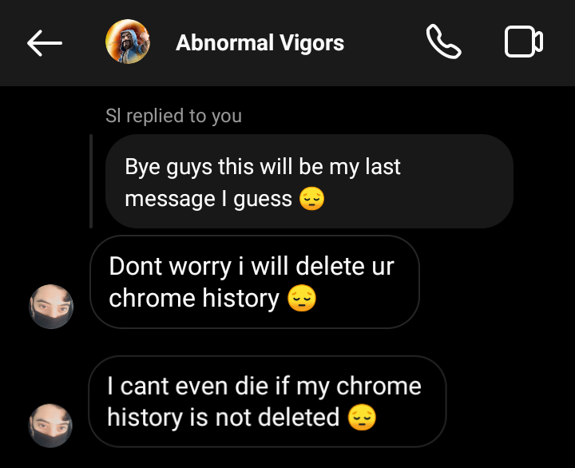
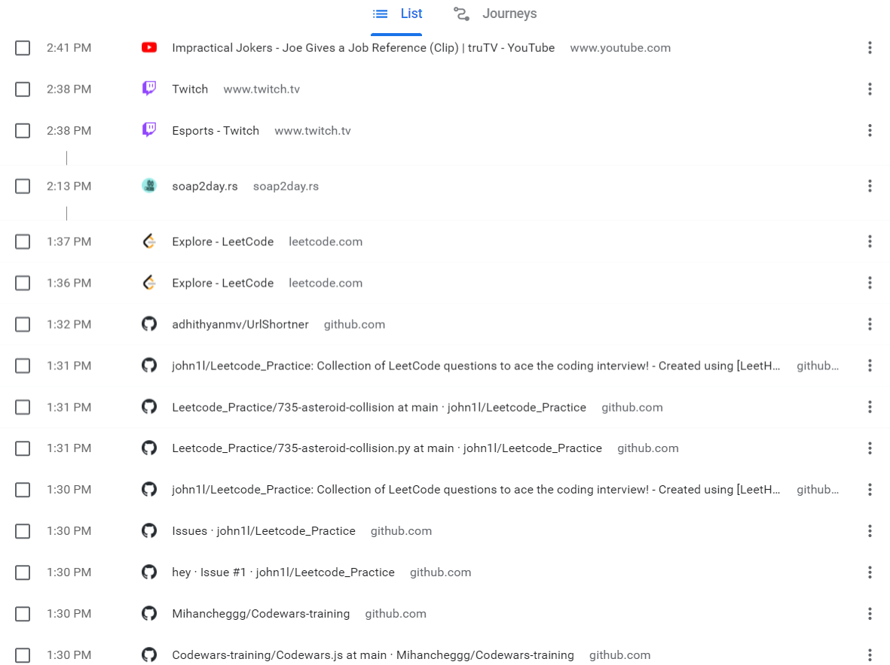
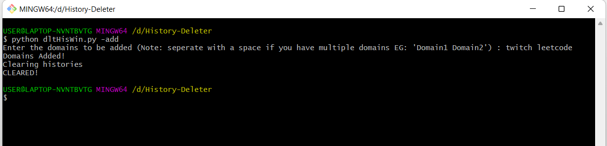
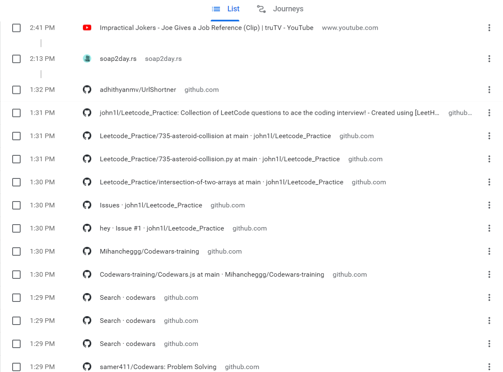

## About



<br>
<br>

The tool which will automatically delete the Chrome history by just givin the website like <b>tryackme</b> instead of <b>https://tryhackme.com/dashboard</b>

## Usage with Screenshots

**1 Before Deleting Histories**

<br>



<br>

**2 Clearing**

<br>



<br>

**3 After Deleting Histories**

<br>



<br>

## Installation

```console
user@example:~git clone https://github.com/adhithyanmv/History-Deleter.git
user@example:~cd History-Deleter
user@example:~python dltHisWin.py
```

## On next update

- Works on Linux & MacOS
- Works with any default browser
- You can set a time where the script will run automatically at that time
- More error handling and '-help'

**Current version is 1.0**
